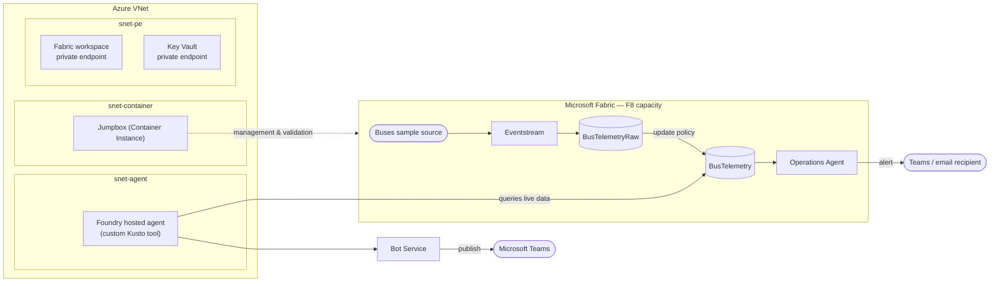

# Fleet Ops Copilot

Real-time bus fleet telemetry, ingested and analyzed on Microsoft Fabric, watched
proactively by a Fabric Operations Agent, and explorable conversationally through
a Foundry-hosted agent published to Microsoft Teams — all on a Fabric F8 capacity
with the conversational agent VNet-injected and the Fabric workspace reachable
over a private link.

## What it does

- **Ingests** live bus telemetry from Fabric's built-in "Buses" sample source
  through an Eventstream into a Fabric Eventhouse (KQL database), flattening
  raw events into a typed `BusTelemetry` table.
- **Monitors** that table continuously with a Fabric **Operations Agent**,
  which detects delay incidents, dwell/holding incidents, and vehicles that
  stop reporting, and sends an alert for each one.
- **Answers questions** through a **Foundry-hosted conversational agent**,
  published to Microsoft Teams, that queries `BusTelemetry` directly via its
  own custom Kusto tool to ground its answers in live data.

## Architecture



- **Microsoft Fabric** — an F8 capacity hosts the workspace, Eventhouse, and
  Operations Agent. The workspace is reachable over a private link
  (`infra/wave2-fabric-privatelink.bicep`).
- **Azure VNet** — three subnets: `snet-agent` (the Foundry account is
  VNet-injected here), `snet-pe` (private endpoints for the Fabric workspace
  and Key Vault), and `snet-container` (a jumpbox reachable via
  `az container exec` — no RDP/Bastion needed).
- **Foundry hosted agent** — real application code (Microsoft Agent
  Framework), not a declarative prompt agent. Its one tool queries the
  Eventhouse directly using its own granted identity.
- **Bot Service + Teams** — the hosted agent is published to Teams through a
  Bot Service registration.

## Deploy

### Prerequisites

- [Azure Developer CLI](https://learn.microsoft.com/azure/developer/azure-developer-cli/install-azd) (`azd`) and the Azure CLI (`az`), both signed in
  (`azd auth login`, `az login`) as a real user — not a service principal.
  Several steps (creating the Operations Agent, the network lockdown) inherit
  their creator's identity and require a delegated human sign-in.
- Python 3.11+.
- An existing Azure AI Search service, Storage account, and Cosmos DB account
  — Foundry's standard agent setup requires all three. If you don't have
  them, `infra/wave0-byo-resources.bicep` creates minimal ones:

  ```bash
  az deployment group create --resource-group <rg> --template-file infra/wave0-byo-resources.bicep
  ```

- A region that isn't `eastus` (the Operations Agent isn't available there)
  and that supports Fabric capacities and Foundry VNet injection.

### 1. Configure

```bash
git clone <this-repo>
cd fleet-ops-copilot
cp .env.example .env   # fill in values
```

Fill in `infra/main.bicepparam`: your Fabric admin UPN(s), your own operator
object ID (`az ad signed-in-user show --query id -o tsv`), and the resource
IDs of the AI Search / Storage / Cosmos DB accounts from the prerequisites
step.

### 2. Provision the core infrastructure

```bash
azd provision
```

This deploys the VNet, F8 Fabric capacity, Key Vault, monitoring, the
jumpbox, and the VNet-injected Foundry account/project — then a
`postprovision` hook automatically creates the Fabric workspace, Eventhouse,
KQL schema, and Eventstream, so telemetry starts flowing right after
`azd provision` finishes.

### 3. Finish the remaining stages

The rest can't be folded into one atomic deployment — each stage needs an ID
or a manual step that only exists after the previous one runs.

**Where to run these from:** every command below is a plain script under
`src/fleetops/`, run with `python <path>` **from the repo root** of your
clone (each script adds its own `src/` to `sys.path`, so no install step or
`PYTHONPATH` is needed) — e.g. on Windows:

```powershell
.venv\Scripts\python.exe src\fleetops\setup\05_network_policy.py --confirm
```

or on macOS/Linux:

```bash
.venv/bin/python src/fleetops/setup/05_network_policy.py --confirm
```

Some of these are plain Azure/Fabric **control-plane** REST calls, signed in
as yourself — they don't need to run from inside the VNet, so your own
machine (wherever you ran `azd provision` from) is fine (marked **local**
below). The rest either test the workspace's *private* endpoint from inside
the network, or call the Foundry account's own data-plane API — and the
Foundry account has public access disabled from the start (it's
VNet-injected), so those genuinely fail with `403 Public access is disabled`
from anywhere but inside the VNet (marked **jumpbox** below). Run those from
the jumpbox — copy the repo onto it once (`curl`+`tar`, since `git clone`
doesn't reliably complete over `az container exec` — see the ACI jumpbox
notes further down), then:

```bash
az container exec --resource-group <rg> --name ci-fleetops-jump \
  --container-name jumpbox --exec-command "python3 /path/to/script.py"
```

| # | Step | Where | Script (path relative to repo root) |
|---|---|---|---|
| 1 | Flip two Fabric admin portal tenant settings (see **Manual steps**) | — | — |
| 2 | Deploy the workspace-level Fabric private link | local | `./infra/deploy.ps1 -Wave 2` |
| 3a | Verify its DNS resolves privately | jumpbox | `src/fleetops/validate/network_check.py` |
| 3b | Lock the workspace down to private-only access | local | `src/fleetops/setup/05_network_policy.py --confirm` |
| 4 | Deploy the Foundry hosted agent[^1][^3] | jumpbox or local | `src/fleetops/foundry/deploy_hosted_agent.py` |
| 5 | Deploy the Bot Service | local | `./infra/deploy.ps1 -Wave 3` |
| 6 | Publish the agent to Microsoft Teams[^2][^3] | jumpbox or local | `src/fleetops/foundry/publish_teams.py` |
| 7 | Click **Generate Playbook** then **Start** on the Operations Agent (see **Manual steps**) — it was already created by the postprovision hook | — | portal only |
| 8 | Validate everything end to end | jumpbox | `src/fleetops/validate/e2e_flow.py` |

[^1]: This step also grants the new agent's identity Fabric workspace/Kusto
    access, which needs a delegated human session — the jumpbox's own
    identity only has enough Foundry permissions for the deploy call itself.
    If you haven't done an interactive `az login` on this particular jumpbox
    container, that grant will fail with `403 InsufficientPrivileges` (the
    deploy still succeeds); re-run just the grant from your own machine —
    the failure message tells you exactly how.

    Separately, if this step fails with a `ProvisioningError` that doesn't
    clear on retry, fall back to building and pushing an image instead of
    building from source:
    1. Deploy `infra/modules/foundry.bicep` with `enableContainerRegistry=true`
       (creates a private ACR).
    2. `az acr update --name <acrName> --public-network-enabled true` —
       **temporarily makes the registry publicly reachable.** ACR Tasks' own
       build agent runs on Azure's general-purpose IP range, not yours, so
       there's no narrower allowlist option than this for a registry that's
       otherwise private-endpoint-only. Do this only for the few minutes the
       build takes.
    3. `az acr build --registry <acrName> --image fleet-incident-agent:v1 --platform linux/amd64 src/fleetops/foundry/hosted_agent`
    4. `az acr update --name <acrName> --public-network-enabled false` —
       **put it back.** Don't skip this.
    5. `python deploy_hosted_agent.py --image <acrName>.azurecr.io/fleet-incident-agent:v1`

    See `deploy_hosted_agent.py`'s module docstring for the same sequence
    inline with the code that consumes it.

[^2]: The script's own log output prints a direct link once publishing
    succeeds — `https://teams.microsoft.com/l/app/<teamsAppId>` — that's a
    real, working deep link straight to the agent, not something you need
    to construct yourself. `titleId` (also printed) isn't enough on its own
    to build one; you need `teamsAppId` from the same publish response,
    which this script now captures into `state.json['teams_publish']`.

    This one call needs a genuinely delegated (human) token, not the
    jumpbox's own managed identity — confirmed live as a
    `400 AADSTS500016 (... is not supported as a resource application to
    execute the flow)` from the `microsoft365/publish` endpoint specifically —
    it does an on-behalf-of exchange a managed-identity token can't
    participate in. `DefaultAzureCredential` on the jumpbox silently prefers
    the managed identity over any interactive `az login` you've done on that
    container, so run this one step with `FLEETOPS_FORCE_CLI_CREDENTIAL=1` to
    force the CLI credential instead. From your own machine (not the
    jumpbox), `DefaultAzureCredential` already falls back to the CLI
    credential on its own — no env var needed there.

[^3]: **The single most important, least obvious step in this whole
    runbook.** The Foundry account's hosted-agent invocation routes
    (`/endpoint/protocols/openai/`, and — critically — the
    `activityProtocol` route Teams itself calls) only get correctly
    registered in Azure's internal routing/DNS layer if the account is
    publicly reachable (`publicNetworkAccess: Enabled`,
    `networkAcls.defaultAction: Allow`) at the time the agent is deployed
    and published. An account created and left `Disabled` from the start —
    the normal, secure-by-default state this repo's Bicep produces — hits a
    **permanent, not-transient** `403 Traffic is not from an approved
    private endpoint` (from inside the VNet) or `404 Subdomain does not map
    to a resource` (from outside it) on every invocation attempt, forever,
    regardless of how the account, Bot Service, or Teams publish are
    configured. This isn't a propagation delay — a real deployment left in
    this state for hours never recovers. Confirmed by direct A/B test: the
    identical agent, identical Bot Service, identical Teams publish call,
    failed permanently when the account was `Disabled` from creation, and
    worked immediately when the account was flipped `Enabled` right after
    creation, before the agent was ever deployed.

    The fix costs nothing extra in the end state — it's purely about
    **ordering**, and both scripts that touch this handle it automatically
    now: `deploy_hosted_agent.py` (step 4) flips the account public before
    doing anything else, and leaves it public (Bot Service and Teams publish
    both still need it). `publish_teams.py` (step 6) flips it back to
    private as its last action, once publishing has actually succeeded. You
    don't need to run any `az resource update` yourself — pass
    `--skip-network-toggle` to either script only if you're deliberately
    managing this by hand (e.g. re-running step 4 after a failed attempt
    where the account is already public).

    The account is still VNet-injected the whole time (`networkInjections`
    with the `agent` scenario pointing at `snet-agent` isn't affected by
    this toggle), so its own connection to the Fabric Eventhouse stays on
    the private link throughout — only the account's own inbound reachability
    changes. Locking back down takes a few minutes to actually take effect
    (confirmed live: a direct public call briefly still succeeded right
    after the toggle, then started correctly returning
    `403 Public access is disabled` a few minutes later) — that's an
    ordinary propagation delay, not a sign anything is wrong. Once locked
    down, real Teams/Bot Service traffic continues working via the
    `enable_m365_public_endpoint` exception set during Teams publish (step
    6); only the account's general public reachability closes.

## Manual steps required

These can't be scripted — they need a human in a portal, or a real
interactive sign-in:

- **Fabric admin portal tenant settings**: enable **Azure Private Link** and
  **Configure workspace-level inbound network rules**, and whatever
  Copilot / Azure OpenAI tenant settings the Operations Agent needs.
- **Resource provider registration**: `Microsoft.Fabric`,
  `Microsoft.BotService`, `Microsoft.App`, `Microsoft.CognitiveServices`,
  `Microsoft.Search`, `Microsoft.DocumentDB`, `Microsoft.Storage`,
  `Microsoft.KeyVault`. Re-register `Microsoft.Fabric` again the first time
  you use workspace-level private link — it has its own registration flag.
- **Starting the Operations Agent** — its item and real instructions (three
  monitoring rules over `BusTelemetry`, captured from a real portal-authored
  agent once, long ago, and committed at
  `artifacts/ops-agent/OperationsAgentV1.json`) are created automatically by
  the `postprovision` hook via `06_ops_agent.py --apply` — no portal
  authoring needed for a normal deploy. Its `dataSources` block is
  re-targeted at whatever Eventhouse exists in *this* environment on every
  `--apply`/`--update` run, so the committed file never goes stale even
  across a full teardown-and-rebuild. Two actions remain genuinely
  portal-only, with no REST/API equivalent at all:
  1. In the [Fabric portal](https://app.fabric.microsoft.com), open your
     workspace (`fleet-ops-copilot` by default) and open the **Fleet
     Operations Monitor** Operations Agent item the hook already created.
  2. Click **Generate Playbook** — this compiles the instructions into the
     agent's actual per-rule KQL query plan.
  3. Click **Start** — the agent won't run until this is clicked, even with
     `shouldRun: true` in its definition.

  If you ever want to edit the instructions themselves, edit
  `artifacts/ops-agent/OperationsAgentV1.json` directly and push with
  `06_ops_agent.py --update <opsAgentId>` (the ID is in `state.json`, or in
  the portal URL bar) — no need to re-author in the portal. `--capture <id>`
  still exists for the rare case of pulling a portal-made edit back into the
  repo.
- **Delegated sign-in**: every setup/validation script must run under a real
  operator's own `az login` session, not a service principal — the
  Operations Agent inherits its creator's identity, and the workspace
  network lockdown is sensitive enough that it should always have a human's
  fingerprints on it.

## Repo layout

```
infra/           Bicep — 3 waves (see infra/README.md), plus the ACI jumpbox
                 and Foundry account/project
infra/hooks/     azd postprovision hooks — run the Fabric pipeline setup
                 scripts automatically after `azd provision`
src/fleetops/    Python — setup/ (Fabric items), foundry/ (hosted agent +
                 Teams publish), actions/ (approval-gated operations),
                 validate/ (smoke tests + full e2e check)
artifacts/       KQL schema, Eventstream definition, Operations Agent
                 instructions
state.json       created at runtime — the seam between Bicep outputs and
                 Python-created resource IDs. Never commit real values;
                 .gitignore covers it.
```
